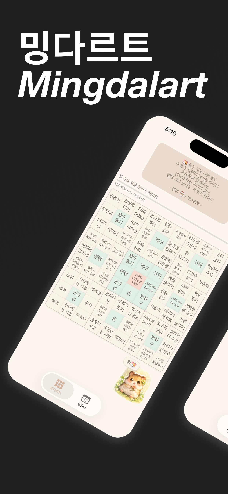
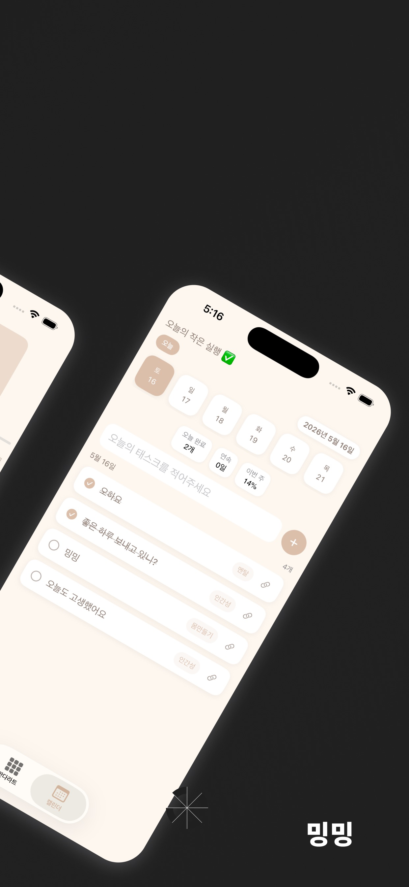
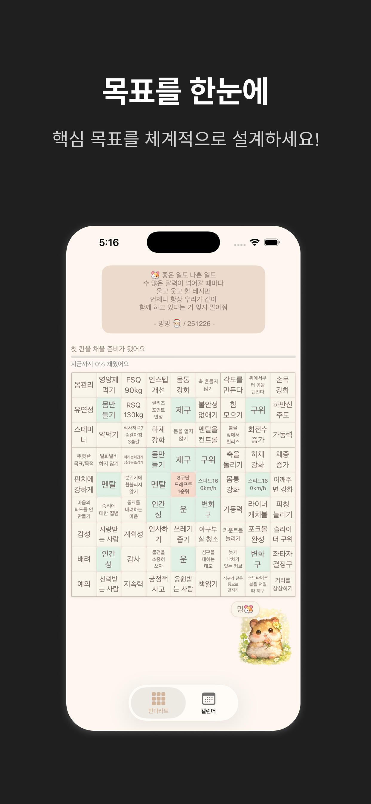
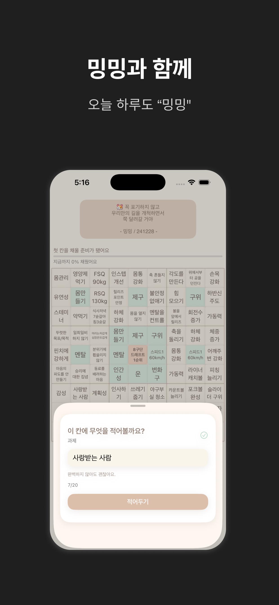
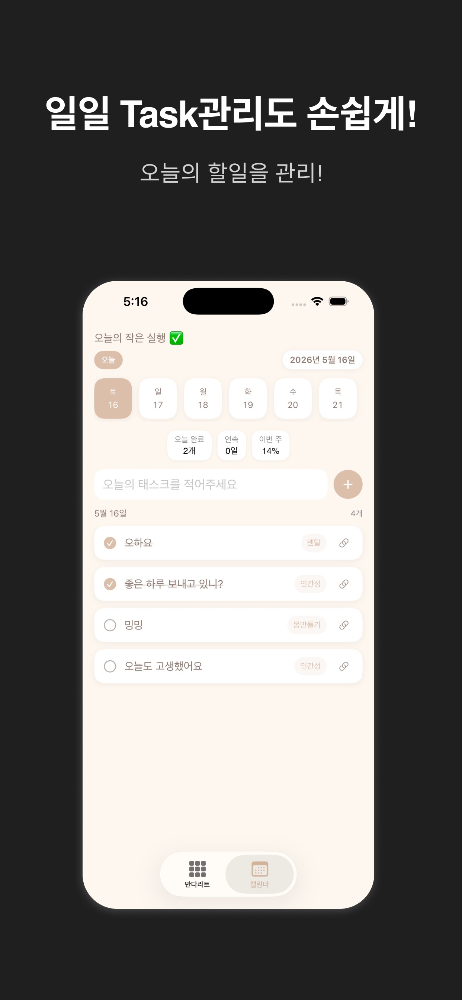
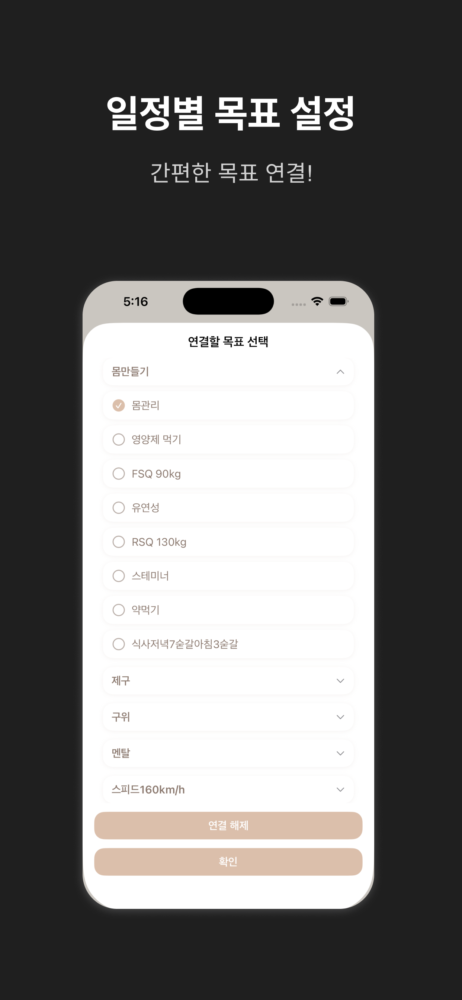

# 밍다르트 Mingdalart

만다르트(9x9) 목표 설계와 캘린더 기반 실행 관리를 한 곳에서 제공하는 iOS 목표 관리 앱입니다.

  
  
  

## 미리보기

| | | |
|---|---|---|
|  |  |  |
|  |  |  |

## 핵심 기능

- 만다르트 9x9 보드에서 메인/서브 목표와 실행 과제 작성
- 셀 완료 상태 추적과 목표 진행률 확인
- 캘린더 기반 일일 Task 생성, 수정, 완료 체크
- Task와 만다르트 실행 과제 연결
- 오늘의 문구, 연속 달성일(streak), 주간 달성률 표시

## 앱 구조

- `Mandala` 탭: 만다르트 설계, 목표 구조화, 진행률 확인
- `Calendar` 탭: 날짜별 Task 관리, 만다르트 과제 연결

## 기술 스택

- Swift
- SwiftUI
- SwiftData
- R.swift

## 아키텍처

레이어 분리 구조를 사용합니다.

- `Presentation`: View, ViewModel
- `Domain`: Model, Repository Protocol, UseCase
- `Data`: Entity, Repository 구현(SwiftData)
- `App`: DI/환경 구성, 앱 엔트리

## 실행 방법

1. Xcode에서 `Mingdalart/Mingdalart.xcodeproj` 열기
2. 타깃 `Mingdalart` 선택 후 Run

요구 환경:
- Xcode 16+
- iOS Deployment Target 18.0

## 링크

- Marketing: `https://yuseongchoi.github.io/Mingdalart/`
- Support: `https://yuseongchoi.github.io/Mingdalart/support.html`
- Privacy: `https://yuseongchoi.github.io/Mingdalart/privacy.html`
